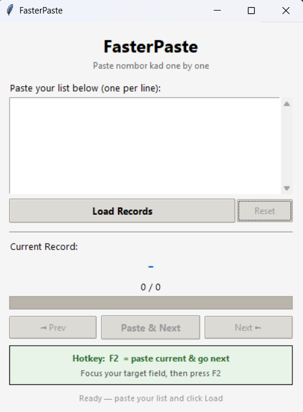
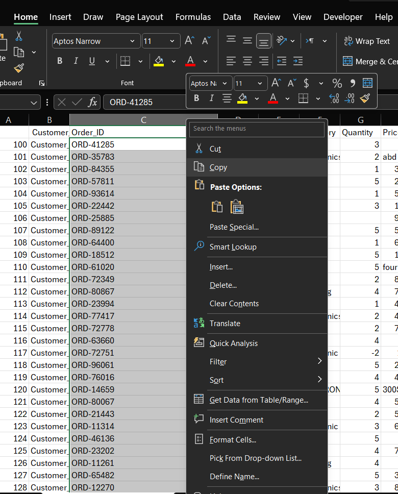
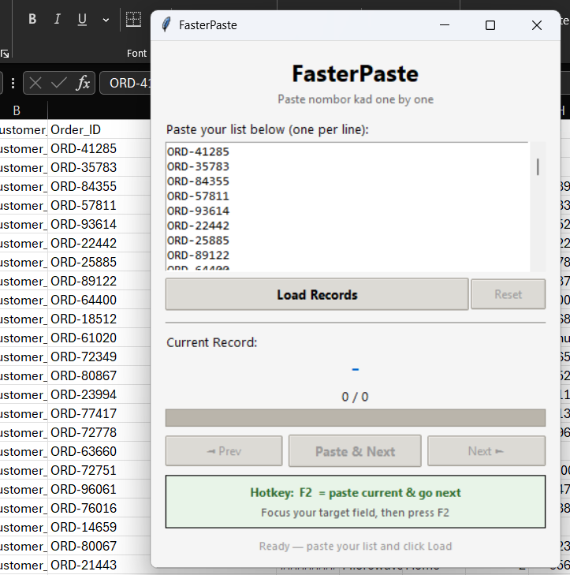
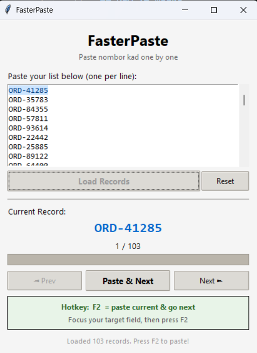
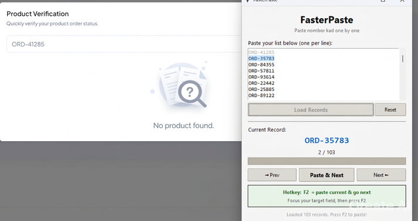
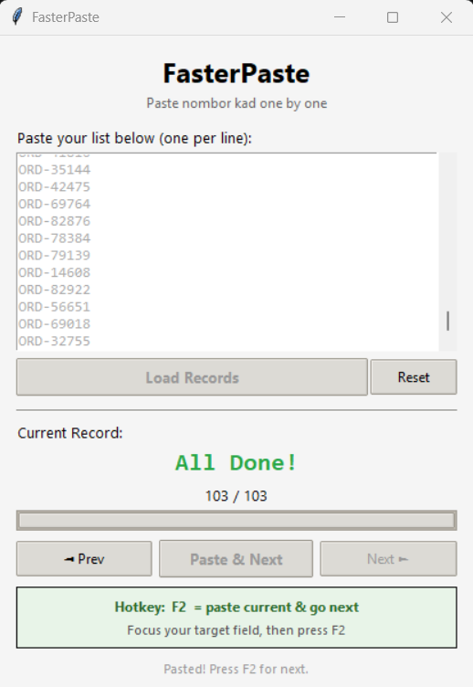

# FasterPaste

A lightweight Windows desktop tool that lets you paste a list of records (e.g. Product ID / Tracking No.) and auto-type them **one by one** into any application using a single hotkey.

Built to speed up repetitive copy-paste workflows — especially when transferring data from Excel into web forms or other systems.



---

## How It Works

### Step 1 — Copy your list from Excel

Select all the Nombor Kad values in your Excel column and copy them (Ctrl+C).



### Step 2 — Paste into FasterPaste

Open FasterPaste and paste (Ctrl+V) the list into the text area. Each record should appear on its own line.



### Step 3 — Click "Load Records"

Click the **Load Records** button. The tool will parse your list and show the first record as the current one.



### Step 4 — Start pasting with F2

1. Switch to your target application (e.g. the web form)
2. Click on the input field where you want to paste
3. Press **F2** on your keyboard
4. The current Nombor Kad is automatically typed into the field
5. FasterPaste advances to the next record
6. Move to the next input field and press **F2** again
7. Repeat until done



### Step 5 — Done!

When all records have been pasted, FasterPaste shows "All Done!" with a completed progress bar.



---

## Features

| Feature | Description |
|---|---|
| **F2 Hotkey** | Global hotkey — works even when FasterPaste is not focused. Pastes current record and auto-advances to the next one. |
| **Always on Top** | The window floats above other apps so you can always see your progress. |
| **Progress Tracking** | Shows current position (e.g. "5 / 20") with a visual progress bar. |
| **Line Highlighting** | Current record is highlighted in blue; completed records are greyed out in the list. |
| **Prev / Next Buttons** | Navigate back to re-paste a record or skip ahead. |
| **Paste & Next Button** | Alternative to F2 — click the button, then switch to your target field within 2 seconds. The tool auto-pastes after the delay. |
| **Reset** | Clear everything and load a new list at any time. |
| **Visual Feedback** | Brief green flash confirms each paste action. |

---

## Interface Overview


**Key areas:**

1. **Text Area** — Where you paste your list (one record per line)
2. **Load / Reset Buttons** — Load your list or clear and start over
3. **Current Record Display** — Shows the next value that will be pasted (large, bold text)
4. **Progress Bar** — Visual indicator of how far along you are
5. **Navigation Buttons** — Prev, Paste & Next, Next
6. **Hotkey Info Box** — Reminder that F2 is your paste key

---

## Installation

### Prerequisites

- **Python 3.8+** installed on Windows
- **pip** (comes with Python)

### Setup

1. Open a terminal in the `FasterPaste` folder

2. Install dependencies:
   ```
   pip install keyboard pyperclip
   ```

3. Run the tool:
   ```
   python faster_paste.py
   ```

**Or simply double-click `run.bat`** — it installs dependencies and launches the tool automatically.

---

## Troubleshooting

| Issue | Solution |
|---|---|
| F2 hotkey not working | Try running as Administrator — the `keyboard` library may need elevated permissions for global hotkeys. |
| Nothing pastes when pressing F2 | Make sure you clicked "Load Records" first. Check that the target input field is focused. |
| Records not loading correctly | Ensure each Nombor Kad is on a separate line. Remove any blank rows or headers before pasting. |
| Tool closes immediately | Run from terminal (`python faster_paste.py`) to see the error message. |

---

## Dependencies

| Package | Purpose |
|---|---|
| `keyboard` | Registers global F2 hotkey and simulates Ctrl+V keypress |
| `pyperclip` | Copies each record to the system clipboard |
| `tkinter` | GUI framework (included with Python) |

---

## Contributing

Contributions are welcome! Here's how you can help:

### Reporting Bugs or Suggesting Features

1. Open an [Issue](../../issues) describing the bug or feature request
2. Include steps to reproduce (for bugs) or a clear description of the feature
3. Add screenshots if relevant

### Submitting Code Changes

1. Fork the repository
2. Create a new branch for your feature or fix (`git checkout -b feature/your-feature`)
3. Make your changes and test them
4. Commit with a clear message (`git commit -m "Add: your feature description"`)
5. Push to your fork (`git push origin feature/your-feature`)
6. Open a **Pull Request** against the `main` branch
7. Describe what your PR does and link any related issues

### Guidelines

- Keep changes focused — one feature or fix per PR
- Test your changes before submitting
- Follow the existing code style

---

## License

This project is licensed under the [MIT License](LICENSE).

